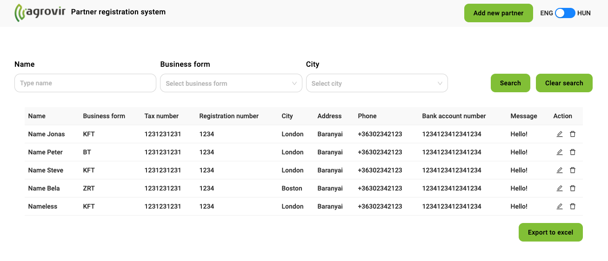

# Partner nyilvántartó rendszer

## Adatbázis

### Partner
  - Név (required)
  - Cégforma
  - Adószám
  - Cégjegyzékszám
  - Település (required)
  - Cím
  - Telefonszám
  - Bankszámlaszám
  - Megjegyzés

### Cégforma
  - Cégforma neve
  - Cégforma azonosítója (id)

### Település
  - Település neve
  - Település azonosítója (id)

## API

### [GET] /partner

Example response:
```json
[
  {
    "id": "id",
    "name": "name",
    "businessForm": "businessForm(id)",
    "taxNumber": "taxNumber",
    "companyRegistrationNumber": "companyRegistrationNumber",
    "city": "city(id)",
    "address": "address",
    "phone": "phone",
    "bankAccountNumber": "bankAccountNumber",
    "message": "message",
  },
  {...},
]
```

### [DELETE] /partner/[id]

Example response:
```json
{
  "message": "Item successfully deleted",
}
```

Example response (non existing id):
```json
{
  "message": "ID doesn't exists.",
}
```

### [PATCH] /partner/[id]

Example request:
```json
{
  "id": "id",
  "name": "name",
  "businessForm": "businessForm(id)",
  "taxNumber": "taxNumber",
  "companyRegistrationNumber": "companyRegistrationNumber",
  "city": "city(id)",
  "address": "address",
  "phone": "phone",
  "bankAccountNumber": "bankAccountNumber",
  "message": "message",
}
```

Example response:
```json
{
  "message": "Item successfully updated",
}
```

### [POST] /partner

Example request:
```json
{
  "id": "id",
  "name": "name",
  "businessForm": "businessForm(id)",
  "taxNumber": "taxNumber",
  "companyRegistrationNumber": "companyRegistrationNumber",
  "city": "city(id)",
  "address": "address",
  "phone": "phone",
  "bankAccountNumber": "bankAccountNumber",
  "message": "message",
}
```

Example response:
```json
{
  "message": "Partner successfully added",
}
```

### [GET] /city

Example response:
```json
[
  {
    "cityId": "cityId",
    "cityName": "cityName",
  },
  {...}
]
```

### [POST] /city

Example request:
```json
{
  "cityName": "cityName",
}
```

Example response:
```json
{
  "message": "City successfully added",
}
```

### [GET] /business-form

Example response:
```json
[
  {
    "cityId": "cityId",
    "cityName": "cityName",
  },
  {...}
]
```

### [POST] /business-form

Example request:
```json
{
  "businessForm": "businessForm",
}
```

Example response:
```json
{
  "message": "Business form successfully added",
}
```

## UI



